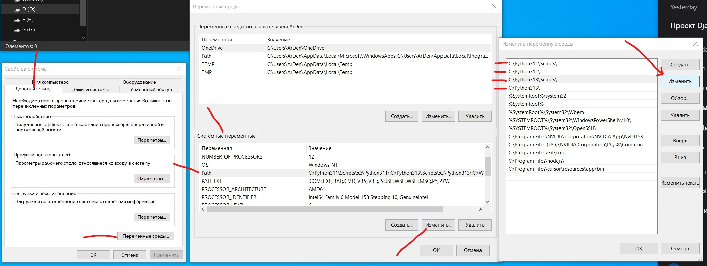

# Работа с виртуальным окружением Python (Windows)

## Изменение переменных среды вручную

1. Нажать **Win + R** → ввести sysdm.cpl
2. Открыть вкладку `Дополнительно` → вкладка `Переменные среды`
3. В разделе `Системные переменные` найти переменную `Path`
4. Нажать `Изменить` и выбрать пути для добавления:
   - C:\Program Files\Python313\Scripts\
   - C:\Program Files\Python313\

---
# Проверка Python и пакетов
-----------------------------------------------
```bash
python --version      # или python -V, версия Python
where python          # путь к установленному Python
python -c "import sys; print(sys.executable)" # Путь
```
```bash
pip list # Стандартный список (как requirements.txt)
pip list --format=columns # С форматированием в таблицу (красиво)
pip list --outdated # Только устаревшие пакеты
pip list --outdated --format=columns # С информацией о версии и последней доступной

```
ПРАВА ДОСТУПА.md
```bash
pip show requests               # установлена ли конкретная библиотека
pip install package_name==1.0.0 # установка конкретной версии пакета
pip uninstall lxml -y           # удаление пакета lxml
python -m pip install --upgrade pip setuptools wheel # Обновляй pip и инструменты

```
-----------------------------------------------


-----------------------------------------------
## Работа с requirements.txt
```bash
pip freeze                   # список всех установленных пакетов
pip freeze > requirements.txt  # сохранить список в файл
pip install -r requirements.txt # установка пакетов из файла
```

```bash
pip install /path/to/package_name # Из локальной директории:
pip install https://example.com/package_name.tar.gz # Из URL-адреса:
```
-----------------------------------------------


-----------------------------------------------
## Создание и удаление виртуального окружения
```bash
python -m venv .venv          # создать виртуальное окружение
rm -r .\venv\                # удалить окружение
C:\Python311\python.exe -m venv .venv  # создать окружение с выбранным интерпретатором
C:\Python313\python.exe -m venv .venv
```

# Активация и деактивация виртуального окружения.
```bash
.\venv\Scripts\activate.ps1  # активировать
deactivate                   # деактивировать
```

# Использование virtualenv
- Для установки виртуального окружения с определённой версией Python необходимо установить библиотеку:
```bash
pip install virtualenv
python -m virtualenv -p "C:\Program Files\Python313\python.exe" my_second_env
```
-----------------------------------------------


-----------------------------------------------
# Возможные ошибки и их решение  Временное изменение политики выполнения (только для текущего терминала)
```bash
Set-ExecutionPolicy -Scope Process -ExecutionPolicy Bypass
.\venv\Scripts\Activate.ps1

# Постоянное решение (навсегда для пользователя)
Set-ExecutionPolicy -Scope CurrentUser -ExecutionPolicy RemoteSigned
```


# Автоматическая активация окружения в VS Code
1. Открыть настройки **(settings.json)**
2. Включить опцию: **Python > Terminal: Activate Env in Current Terminal**
3. Будет создан .js-файл для автоактивации окружения.

# Работа с интерпретатором Python в VS Code
1. Выбор интерпретатора: **Python: Select Interpreter**
2. Создание нового окружения: **Python: Create Environment**